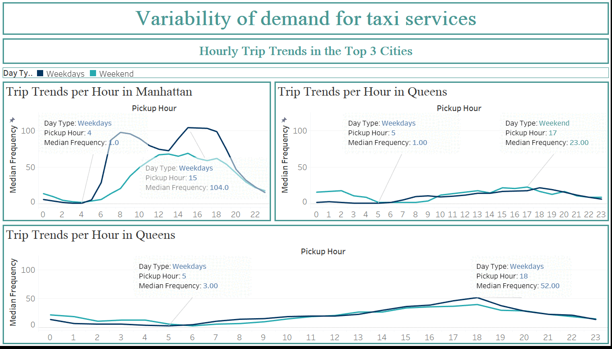

# 🚕 **NYC Taxi Trip Record Analysis**

### 📊 **Pendekatan Analitik untuk Efisiensi Operasional dan Profit Maksimal Taksi Hijau di NYC**

**Data Analyst: Ahmad Faik Setiawan**

## 🏙️ Latar Belakang

Di tengah meningkatnya kebutuhan mobilitas masyarakat urban, layanan taksi tetap menjadi komponen penting dalam sistem transportasi perkotaan, khususnya di New York City. Dengan cakupan wilayah yang luas dan karakteristik perjalanan yang beragam di tiap borough, muncul kebutuhan mendesak bagi pengelola armada dan pengemudi untuk memahami di mana dan kapan potensi pendapatan terbesar dapat dioptimalkan.
Analisis ini memanfaatkan data perjalanan taksi (Januari 2023) dari NYC TLC untuk mengungkap pola pendapatan dan permintaan berbasis waktu dan wilayah.

## 🎯 Stakeholder

- 🧭 **Divisi Operasional dan Armada:** Butuh alokasi kendaraan yang efisien.

## ❓ Permasalahan

Bagaimana mengenali pola pendapatan berdasarkan waktu dan lokasi agar strategi operasional taksi lebih adaptif dan menguntungkan?

## 🎯 Tujuan

1. Menganalisis distribusi pendapatan berdasarkan borough, zona, jam, dan hari.
2. Mengidentifikasi pola konsisten waktu-lokasi dengan pendapatan tertinggi.
3. Memberi insight untuk driver, pengelola armada, dan regulator.

## 💡 Insight Kunci

- 🏢 **Manhattan** → fokus armada pagi-sore (weekdays).
- 🌆 **Queens & Brooklyn** → efektif sore-malam (terutama weekend).
- ⏰ **Golden Hour (05:00–06:00)** → pendapatan per trip tertinggi.
- 🎯 **Promosi Terarah:** Insentif spesifik zona-waktu (Queens, JFK, Forest Hills).
- 🧩 **Efisiensi di Bronx/Staten Island:** Kurangi armada atau batasi jam operasi.
- 💸 **Strategi Tip:** Dorong trip panjang/kecepatan stabil untuk tip lebih tinggi.

## 🧰 Tools & Teknologi

- 📦 **Python:** pandas, numpy, geopandas, folium, matplotlib, seaborn
- 📍 **Branca + GeoJSON:** untuk visualisasi spasial interaktif
- 📊 **Tableu:** untuk desain dan pembuatan dashboard
- 🗂️ **Jupyter Notebook:** sebagai media eksplorasi dan dokumentasi analisis

## 📂 Dataset

- 🚖 **NYC TLC Green Taxi Trip Records – January 2023**
  [https://www.nyc.gov/site/tlc/about/tlc-trip-record-data.page](https://www.nyc.gov/site/tlc/about/tlc-trip-record-data.page)
- 🌐 **NYC Taxi Zone Lookup Table & GeoJSON**
  Zona pickup/dropoff dan boundary tiap borough/zona
